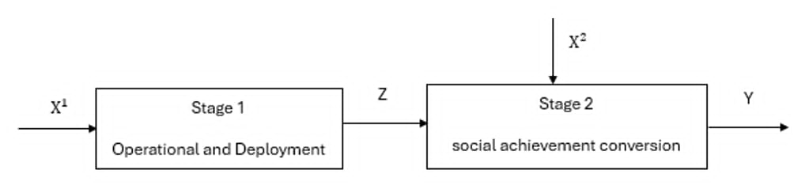

本章建立評估偏鄉需求反應式公共運輸績效之兩階段NDEA，並透過SROI之社會價值貨幣化技術，進行社會價值衡量。

## 3.1 兩階段NDEA架構

研究使用無導向SBM-NDEA，目的是最小化投入的差額與產出的差額，其NDEA架構圖如下圖
3.1 所示：
{width=85%}

研究將活動出車n(n=1,...,N)分為兩階段，活動出車n的第一階段有三種投入$x_k^1$(k=1,...,3)，他會產生三種中間產物流向第二階段$z_k^1$(k=1,...,3)，第二階段則只有一種投入$x_1^2$，並透過這個投入與三種中間產物產出三種最終產出$y_r^2$(r=1,...3)。

## 3.2  社會投資報酬率（SROI）方法與社會價值貨幣化流程

本節將詳細說明如何盤點利害關係人，並透過轉變理論（Theory of Change, ToC）與金融代理變數（Financial Proxies），將無形的社會價值具體貨幣化，作為模型第二階段之最終產出變數。

### 3.2.1 利害關係人判定原則與轉變理論

根據 SROI 評估指引之核心原則，利害關係人定義為「因本服務或計畫之投入，而經歷或創造轉變（無論正負向、預期與否）之個人、群體或組織」(Nicholls et al,. 2012)。在方法論建構上，確立評估範疇與因果路徑需遵循以下兩大核心理論機制：

實質性原則（Principle of Materiality）：
在界定利害關係人時，本研究以「是否對決策或服務產生實質投入」以及「其福祉是否因該服務而產生顯著之質變或量變」作為篩選依據。此原則能有效排除關聯度極低之外部個體，確保計量模型之產出向量具有高度相關性與代表性。

轉變理論之因果關係：
轉變理論是用來還原無形價值之因果邏輯。要求把評估對象之「投入」、「產出」與利害關係人實質的「成效」進行嚴謹的因果連結。透過此一機制，本研究可以更聚焦在服務所創造的社會價值與心理轉變。

### 3.2.2 社會價值貨幣化量化方式

為還原無市場交易定價之主觀福利與生態環境效益，研究採用三種國際公認之價值貨幣化技術：

1.市場替代法（Market Approach）：應用於「時間與費用節省」。用使用服務者原本打算使用的交通方式替換成實際價值並結合最低時薪計算使用者因共乘服務省下的時間價值

2.替代成本法（Replacement Cost Approach）：應用於「二氧化碳減量價值」。計算乘車者若自行開車或搭乘其他交通工具之排放量，與共乘車輛之差額，並套用當前碳權交易市場之每噸碳價進行生態價值貨幣化。

3.敘述偏偏好法與支付意願（Stated Preference & Willingness to Pay, WTP）：應用在「參與收穫價值」。針對無法在市場交易的主觀社會價值（如高齡長者社交孤立感之降低、志工司機參與社區之成就感），透過問卷調查，評估受訪者心中對於獲得此等心理與健康狀態所願意支付的等值貨幣化金額。

## 3.3 兩階段NDEA模型

基於 NDEA 結構，研究建構一個整合 SROI 貨幣化指標之非導向、兩階段NDEA模型。本研究採用非導向鬆弛變數（Slacks-Based Measure, SBM）之目標式，並在變動規模報酬（Variable Returns to Scale, VRS）假設下，對個別車次之轉換效率進行求解。

### 3.3.1 目標函數

於任一被評估之特定共乘車次 $\text{DMU}_k$（其中 $k \in \{1, \dots, N\}$），本研究之非導向兩階段 NSBM 之目標函數旨在同時最小化第一階段與第二階段之投入(產出)冗餘（浪費）

其中，數學目標式如下:

$$\vartheta_k^* = \min_{} \frac{ \left( 1 - \left( \frac{1}{3} \sum_{i=1}^3 \frac{s_{input,i}^1}{x_{ik}^1} \right) \right) + \left( 1 - \left( \frac{s_{input}^2}{x_k^2} \right) \right) }{ \left( 1 + \frac{1}{3} \sum_{t=1}^3 \frac{s_{link,t}^{12}}{z_{tk}^{12}} \right) + \left( 1 + \frac{1}{3} \sum_{j=1}^3 \frac{s_{output,j}^2}{y_{jk}^2} \right) } \quad (3.3.1)$$

### 3.3.2 限制函數

限制條件如下：

第一階段：營運與派遣（Process 1）

$$\sum_{n=1}^N x_{in}^1 \lambda_n^1 + s_{input,i}^1 = x_{ik}^1 , \quad \forall i = 1, 2, 3 \quad (3.3.2)$$

$$\sum_{n=1}^N z_{tn}^{12} \lambda_n^1 - s_{link,t}^{12} = z_{tk}^{12} , \quad \forall t = 1, 2, 3 \quad (3.3.3)$$

第二階段：社會價值轉化（Process 2）

$$\sum_{n=1}^N x_{1n}^2 \lambda_n^2 + s_{input}^2 = x_k^2 \quad (3.3.4)$$

$$\sum_{n=1}^N z_{tn}^{12} \lambda_n^2 + s_{link,t}^{12} = z_{tk}^{12} , \quad \forall t = 1, 2, 3 \quad (3.3.5)$$

$$\sum_{n=1}^N y_{jn}^2 \lambda_n^2 - s_{output,j}^2 = y_{jk}^2 , \quad \forall j = 1, 2, 3 \quad (3.3.6)$$

連結與規模報酬（Link & VRS）

$$\sum_{n=1}^N z_{jn}^{12} \lambda_n^1 \ge \sum_{n=1}^N z_{jn}^{12} \lambda_n^2 , \quad \forall j = 1, 2, 3 \quad (3.3.7)$$

$$\sum_{n=1}^N \lambda_n^1 = 1, \quad \sum_{n=1}^N \lambda_n^2 = 1 \quad (3.3.8)$$

$$\lambda_n^1 \ge 0, \quad \lambda_n^2 \ge 0 , \quad \forall n = 1, \dots, N \quad (3.3.9)$$

## 3.3.3 變數與符號定義

$k$：DMU，即每一趟獨立之共乘活動($k = 1, \dots, n$)。

$i$：第一階段之原始直接投入變數 ($i=1, 2, 3$，對應司機時間、補貼油資、學生時間)。

$j$：兩階段間之中間變數，亦即第一階段產出與第二階段投入 ($j=1, 2, 3$，對應準時程度、有效人公里、服務覆蓋度)。

$r$：第二階段最終社會福祉產出變數 ($r=1, 2, 3$，對應時間費用節省、減碳量價值、參與收穫價值)。

$n$：所有車次之集合 ($n=1, \dots, n$)。

參數與決策變數：

$\vartheta_k^*$：車次 $k$ 之兩階段總體效率（值介於 0 至 1，愈接近 1 代表效率愈佳）。

$\lambda_n^1, \lambda_n^2$：第一、二階段之權重向量，代表各 DMU 在效率前緣上的線性組合權重。

$x_{ik}^1, x_{1k}^2$：車次 $k$ 在第一、二階段之實際觀測投入量。

$z_{jk}^{12}$：車次 $k$ 的第j個中間變數觀測值。

$y_{rk}^2$：車次 $k$ 的第r個最終產出觀測值。

$s_{i1}, s_{12}$：對應第一、二階段之投入冗餘鬆弛變數（代表投入資源之浪費程度）。

$s_{j}^{link,in}, s_{j}^{link,out}$：中間變數於第一階段流向第二階段過程的不足與過剩鬆弛變數。

$s_{r2}^2$：第二階段最終產出之不足鬆弛變數。

式 (3.3.2) 此式限制第一階段的投入項（$x_{input,j}^1$）的配置應等於其他DMU的第二階段投入線性組合加上差額($s_{input,j}^1$)

式 (3.3.3) 此式限制階段一的中間產物產出應等於其他DMU的中間產物產出的線性組合減去差額($s_{link,t}^12$)

式 (3.3.4)：此式限制第二階段的投入項（$x_k^2$）的配置合理性。應等於其他DMU的第二階段投入線性組合加上差額($s_{input}^2$)

式 (3.3.5)：此式限制階段二的中間產物投入應等於其他DMU的中間產物投入的線性組合加上差額($s_{link,t}^12$)

式 (3.3.6) 此式限制階段二的最終產出應等於其他DMU的最終產出的線性組合加上差額($s_{output,j}^2$)

式 (3.3.7) ：這是兩階段網絡模型的連結，強制規範第一階段營運所創造之中間產出量，必須大於或等於第二階段轉化福祉時所消耗之資源量。此約束確保了營運供給與社會福祉轉化在數學上的「流動守恆」，防止數據在階段傳遞中出現非法創造，保障績效評估之嚴謹性。

式 (3.3.8) 規模報酬假設（VRS）：透過 $\sum \lambda = 1$ 之限制，設定本模型為變動規模報酬（VRS）

本章透過NDEA之架構，將偏鄉運輸之營運流程拆解為「營運與派遣」與「社會價值轉化」兩階段。透過NSBM的建構，不僅將傳統運輸績效評估中難以量化之社會外部性（透過 SROI 貨幣化指標），轉化為模型之最終產出矩陣，更透過網絡流動連續性與 VRS 假設之約束，解構了資源在各個階段間的轉化。

本章所建立之數學規劃架構，具備兩項關鍵之管理診斷潛力，這些計量指標不僅能評估共乘系統在當前資源配置下之綜合績效，更為後續第四章之實證分析提供理論基礎，用以識別個別車次之管理問題，並為偏鄉交通之資源配置優化提供具備統計顯著性之實務依據。
